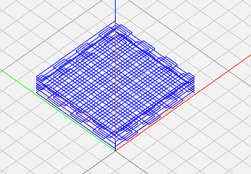

# Gcode-Generator

Generates gcode for scaffold printing with allevi.  

Better interface currently in development. For now just put it into C compiler and run it. I use this one https://www.onlinegdb.com/online_c_compiler   

In development: 

Circular scaffold

Proper code organization (headers, etc) 

Actual interface (website, etc) 
